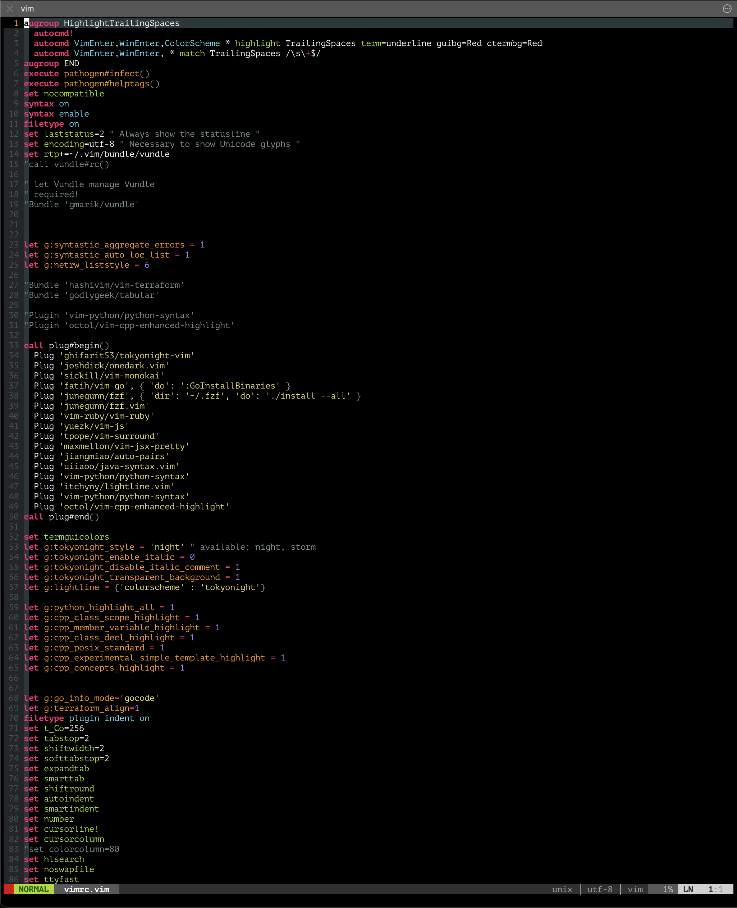

Demo




.vim
====
For MacOS, install homebrew:
```
/bin/bash -c "$(curl -fsSL https://raw.githubusercontent.com/Homebrew/install/HEAD/install.sh)"
```
Then install vim with python3 support from brew, the pre-installed vim on Mac does not support python3 that make youcompleteme unavailable:
```
brew install vim
```
Might need to run brew link:
```
brew link vim
```
Quit terminal and reopen it to activate vim from brew

```bash
cd ~
git clone https://github.com/sontung1010/.vim.git
cd .vim
rake setup
vim .vimrc
-->:PlugInstall
```

Everytime put in a new Plug, make sure to save vimrc file then quit terminal, reopen it and run :PlugInstall to make sure everything run properly

For YouCompleteMe, follow this link to install:

```
https://github.com/ycm-core/YouCompleteMe
```

BASH setup
====
From this link: https://askubuntu.com/questions/851186/how-to-add-colored-git-branch-to-my-bash-prompt#:~:text=You%20only%20need%20to%20use,resets%20formatting%20on%20the%20text.
paste this in bashrc:

```bash
# show git branch in prompt
git_branch() {
    # -- Finds and outputs the current branch name by parsing the list of
    #    all branches
    # -- Current branch is identified by an asterisk at the beginning
    # -- If not in a Git repository, error message goes to /dev/null and
    #    no output is produced
    git branch --no-color 2>/dev/null | sed -e '/^[^*]/d' -e 's/* \(.*\)/\1/'
}

git_status() {
    # Outputs a series of indicators based on the status of the
    # working directory:
    # + changes are staged and ready to commit
    # ! unstaged changes are present
    # ? untracked files are present
    # S changes have been stashed
    # P local commits need to be pushed to the remote
    local status="$(git status --porcelain 2>/dev/null)"
    local output=''
    [[ -n $(egrep '^[MADRC]' <<<"$status") ]] && output="$output+"
    [[ -n $(egrep '^.[MD]' <<<"$status") ]] && output="$output!"
    [[ -n $(egrep '^\?\?' <<<"$status") ]] && output="$output?"
    [[ -n $(git stash list) ]] && output="${output}S"
    [[ -n $(git log --branches --not --remotes) ]] && output="${output}P"
    [[ -n $output ]] && output="|$output"  # separate from branch name
    echo $output
}

git_color() {
    # Receives output of git_status as argument; produces appropriate color
    # code based on status of working directory:
    # - White if everything is clean
    # - Green if all changes are staged
    # - Red if there are uncommitted changes with nothing staged
    # - Yellow if there are both staged and unstaged changes
    local staged=$([[ $1 =~ \+ ]] && echo yes)
    local dirty=$([[ $1 =~ [!\?] ]] && echo yes)
    if [[ -n $staged ]] && [[ -n $dirty ]]; then
        echo -e '\033[1;33m'  # bold yellow
    elif [[ -n $staged ]]; then
        echo -e '\033[1;32m'  # bold green
    elif [[ -n $dirty ]]; then
        echo -e '\033[1;31m'  # bold red
    else
        echo -e '\033[1;37m'  # bold white
    fi
}

git_prompt() {
    # First, get the branch name...
    local branch=$(git_branch)
    # Empty output? Then we're not in a Git repository, so bypass the rest
    # of the function, producing no output
    if [[ -n $branch ]]; then
        local state=$(git_status)
        local color=$(git_color $state)
        # Now output the actual code to insert the branch and status
        echo -e "\x01$color\x02[$branch$state]\x01\033[00m\x02"  # last bit resets color
    fi
}

# Sample prompt declaration based off of the default Ubuntu 14.04.1 color
# prompt. Tweak as you see fit, or just stick "$(git_prompt)" into your
# favorite prompt.
PS1='$debian_chroot\[\033[01;32m\]\u@\h\[\033[00m\]:\[\033[01;34m\]\w$(git_prompt)\[\033[00m\]\$ '

# Set history format to include timestamps
HISTTIMEFORMAT="%Y-%m-%d %T "
```

ZSH setup (Be careful when working with ROS)
====

- Install Homebrew for MacOS
- Install iTerm2 or Terminator
- Install zsh
- Install Oh-my-zsh:
```
https://github.com/ohmyzsh/ohmyzsh.git
```
- Install Powerlevel10k:
```
git clone https://github.com/romkatv/powerlevel10k.git $ZSH_CUSTOM/themes/powerlevel10k
```
-- Plugin zsh-autosuggestions:
```
https://github.com/zsh-users/zsh-autosuggestions/blob/master/INSTALL.md#oh-my-zsh
```
-- Plugin zsh-syntax-highlighting:
```
https://gist.github.com/kevin-smets/8568070
```
