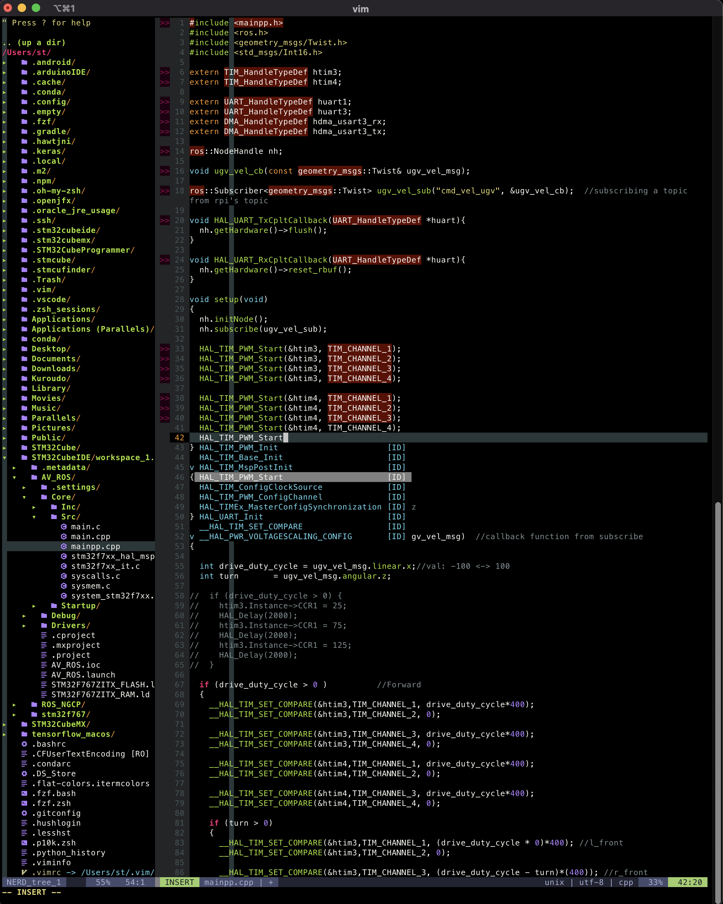

Demo




.vim
====
For MacOS, install homebrew:
```
/bin/bash -c "$(curl -fsSL https://raw.githubusercontent.com/Homebrew/install/HEAD/install.sh)"
```
Then install vim with python3 support from brew, the pre-installed vim on Mac does not support python3 that make youcompleteme unavailable:
```
brew install vim
```
Might need to run brew link:
```
brew link vim
```
Quit terminal and reopen it to activate vim from brew

```bash
cd ~
git clone https://github.com/sontung1010/.vim.git
cd .vim
rake setup
vim .vimrc
-->:PlugInstall
```

Everytime put in a new Plug, make sure to save vimrc file then quit terminal, reopen it and run :PlugInstall to make sure everything run properly

For YouCompleteMe, follow this link to install:

```
https://github.com/ycm-core/YouCompleteMe
```

BASH setup
====
From this link: https://thucnc.medium.com/how-to-show-current-git-branch-with-colors-in-bash-prompt-380d05a24745, paste this in bashrc:

```bash
# show git branch in prompt
parse_git_branch() {
     git branch 2> /dev/null | sed -e '/^[^*]/d' -e 's/* \(.*\)/(\1)/'
}
export PS1="\u@\h \[\e[32m\]\w \[\e[91m\]\$(parse_git_branch)\[\e[00m\]$ "
```


ZSH setup (Be careful when working with ROS)
====

- Install Homebrew for MacOS
- Install iTerm2 or Terminator
- Install zsh
- Install Oh-my-zsh:
```
https://github.com/ohmyzsh/ohmyzsh.git
```
- Install Powerlevel10k:
```
git clone https://github.com/romkatv/powerlevel10k.git $ZSH_CUSTOM/themes/powerlevel10k
```
-- Plugin zsh-autosuggestions:
```
https://github.com/zsh-users/zsh-autosuggestions/blob/master/INSTALL.md#oh-my-zsh
```
-- Plugin zsh-syntax-highlighting:
```
https://gist.github.com/kevin-smets/8568070
```
